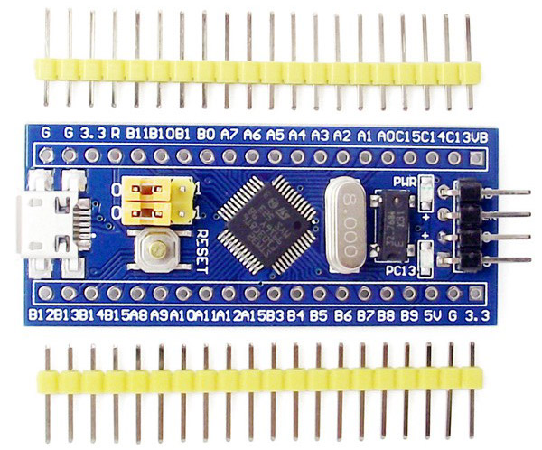

# Blue Pill STM32F103C8T6

:warning: Work in progress. Depends on STM32F1 support in MicroPython.

MicroPython board definition files for the generic blue pill STM32F103C8T6 dev board.

**Brand:** vcc-gnd/Generic

**Markings:** http://vcc-gnd.taobao.com/



You can buy one for around $2 USD on [AliExpress](https://www.aliexpress.com/item/mini-Stm32f103c8t6-system-board-stm32-learning-development-board/1568685935.html)

### Build and deploy the firmware:

:warning: Most likely does not work yet.

* Clone the board definitions to your [MicroPython](https://github.com/micropython/micropython) ports/stm32/boards folder.

```
cd micropython/ports/stm32/boards
git clone https://github.com/mcauser/BLUE_PILL_F103C8.git
```

* Disconnect the board from USB
* Set BOOT0 jumper to ON (BT0->3V3)
* Connect the board via USB

```
cd micropython/ports/stm32
make BOARD=BLUE_PILL_F103C8
make BOARD=BLUE_PILL_F103C8 deploy
```

* Disconnect the board from USB
* Set BOOT0 jumper to OFF (BT0->GND)
* Connect the board via USB

```
$ screen /dev/tty.usbmodem1422
```

### Specifications:

* STM32F103C8T6 ARM Cortex M3
* 72MHz, 90 DMIPS / 1.25 DMIPS / MHz
* 2.0V - 3.6V operating voltage
* 8MHz system crystal
* 32.768KHz RTC crystal
* 2.54mm pitch pins
* JTAG/SWD header
* 64 KByte Flash, 20 KByte SRAM
* 2x SPI, 3x USART, 2x I2C, 1x CAN
* 38 I/Os almost all 5V-tolerant
* 1x USB 2.0 FS
* 2x ADC (12-bit / 16-channel)
* 3x general timers, 1x advanced timer
* RT9193 3.3V LDO voltage regulator, max current 300mA
* Micro USB for power and data
* Blue user LED (PC13)
* 2x jumpers for bootloader selection
* Reset button
* 2x20 side pins + 1x4 SWD pins
* Dimensions: 53.0mm x 22.5mm

### Experimental:

Some C8 microcontrollers have been discovered to have [128 KB flash instead of 64 KB](http://wiki.stm32duino.com/index.php?title=Blue_Pill#128KB_Flash_on_C8_version).
To fit MicroPython on this board, we'll try to use 128KB flash and pretend it's a F103CB board instead of F103C8. CB=128K, C8=64K.

Some C8 boards ship with incorrect USB pull up resistors. More on that later.

### Links:

* [STM32F103C8 on st.com](http://www.st.com/content/st_com/en/products/microcontrollers/stm32-32-bit-arm-cortex-mcus/stm32-mainstream-mcus/stm32f1-series/stm32f103/stm32f103c8.html)
* [Blue Pill on stm32duino wiki](http://wiki.stm32duino.com/index.php?title=Blue_Pill)
* [VCC GND branded STM32F103C8T6 Blue Pill](https://world.taobao.com/item/22097803050.htm?fromSite=main&spm=a312a.7700824.w4002-6273769129.41.46515f912HOxBD)
* [Buy on AliExpress](https://www.aliexpress.com/item/mini-Stm32f103c8t6-system-board-stm32-learning-development-board/1568685935.html) or search for "STM32F103C8T6"
